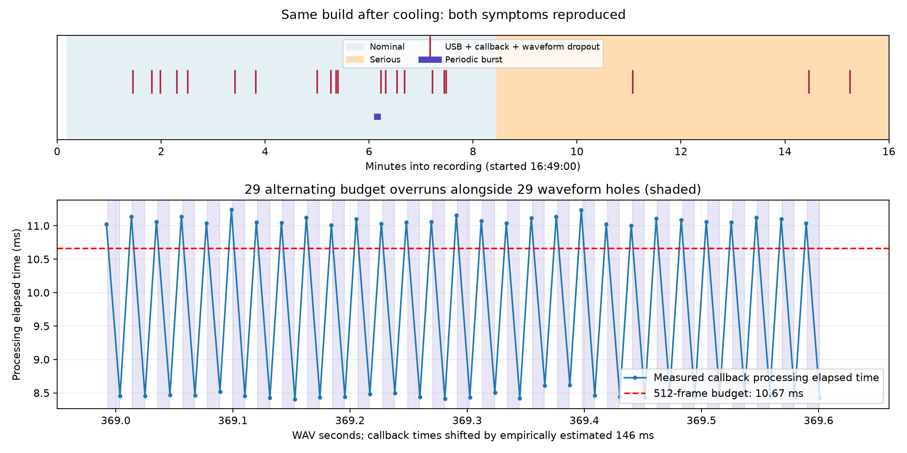

# Completed cooled repeat — September 10, 2026

**Both symptoms returned after passive cooling and restarting the same binary.** The extra hot five minutes had stayed clean. This repeat recorded 16:49:00.456–17:05:00.456 (960 seconds; first 11.620 seconds are planned prelaunch silence). Recording completed with return 0 and empty stderr. Same patch/configuration, JUCE 8.0.15, normal DSP/UI/autoplay, MIDI worker enabled, actual 48 kHz and settled 512-frame callbacks. User had confirmed functioning WRLD.BLDR LEDs in this binary. No screenshots or iPad queries occurred after startup verification until recording ended.

| Observation | Result |
| --- | --- |
| Long analog interruptions | 21, each approximately 224–231 ms |
| Matching MAYA transaction errors | 21 |
| Matching driver restarts / callback stalls | 21 / 21; stalls 220–230 ms |
| Brief periodic corruption | 29 holes over about 0.608 s; approximately 10 ms blank every 21.3 ms |
| Nominal state | 18 long interruptions over 8m16s |
| Serious state | 3 long interruptions over 7m32s |
| MIDI queue faults | None; 39,461 additional SysEx handler submissions |

## Sporadic interruptions

All 21 actual analog interruptions match distinct MAYA transaction failures, driver restarts and callback gaps. Driver restart requests follow the USB error by 33.5–39.5 ms. The largest instrumented processing duration within the 100 ms preceding any long stall is 5.461 ms, below the 10.667 ms block budget. This again supports the observed failure → restart → missing-callback chain; it does not identify what initiates the USB error.

The raw activity/correlation count is 22 because it includes the expected prelaunch silence. Raw outputs were preserved unchanged; the final count explicitly excludes that one interval. Refined full losses span 224.292–230.708 ms (median 229.021), longer than the 117–227 ms below-noise cores because analog settling takes time.

## Periodic burst: a specific new timing clue

At WAV 368.993–369.601 s (about 16:55:09), the waveform has **29 holes**, median width 10.167 ms, median onset interval 21.323 ms. One hole begins in second 368, so the unchanged dense-bin detector reports 28 in second 369; inspection includes the adjacent hole.

At the corresponding app time, **29 alternate callbacks** (33287 through 33343, step 2) take **11.001–11.241 ms**, exceeding their **10.667 ms** budget. Intervening callbacks take 8.403–8.618 ms. No other settled callback exceeds its budget during the recording. The native xrun counter stays 12 across this burst, and arrival gaps stay 9.687–11.642 ms: no 200 ms callback stall is required for this symptom. There are no nearby transaction-error, restart, drift or zero-length-transfer reports. This is consistent with alternating missed output deadlines and shows why native xrun counts alone cannot establish clean output.

This is elapsed processing time, not thread CPU time: it includes MakeIOInfo and normal processing, can include descheduling or blocking, and excludes trailing diagnostics and outer JUCE/native work. We have not located the expensive or interrupted section. The alignment uses a locally interpolated 146 ms offset from neighboring long-gap matches; it is not a direct transport-latency measurement. This observed burst must not be generalized into an explanation of earlier pure-tone corruption that occurred without such overruns.

## Thermal comparison

Nominal was actually verified at startup. The OS thermal notification arrived at 16:57:27.165; the app's one-second sampler first reports serious at approximately 16:57:27.966. The long-dropout rate was about 2.18/min during nominal and 0.40/min during serious. However, matched dropouts still occurred at approximately 17:00:05, 17:03:28 and 17:04:15 after the transition. **Serious state is not sufficient to prevent failure.** The previous hot restart also had two failures before its analog recording.

The prior measured hot 16 minutes and additional 299.776 seconds had zero long interruptions or dense periodic episodes. Cooling/restart is associated with renewed failure in this comparison, but restart, elapsed time, workload and power policy remain confounded. Neither hub/interface temperature nor charging current is measured. No thermal/GPU condition was induced. App source only logs thermal state; it does not implement a thermal-dependent DSP/UI/MIDI change.

## Coverage, startup and retained evidence

88,478 callbacks, no sequence holes or logger misses; 48 kHz throughout, 470 frames only during initialization and settled 512 frames thereafter, low-power 0 and unmuted. Native xr goes 0→22: one initialization discontinuity plus the 21 matched long interruptions. There are 30 instrumented budget overruns: one 18.535 ms initialization callback and the 29 in the periodic burst. Five configuration restarts occur before playback and are separate from the 21 failure-associated restarts. The startup xr event has no matched long waveform/USB interruption.

Three zero-length-transfer reports total four transfers at 16:49:44–50, away from the later periodic burst. Of 13 drift records, six precede playback. There is no evidence here that those earlier reports directly cause the 16:55 periodic burst.

The archive was collected at 17:10:29–17:11:06 over the already paired Wi-Fi connection (802 files, 221,207,299 bytes). The matching app log was retrieved at 17:12:05, 19,739,270 bytes; log identity and patch/config hashes are unchanged. MIDI worker enabled/running in all 942 samples, sampled SysEx depth 0–2, no full/invalid/discard counts. Submission counters are handler calls, not physical packet acknowledgments.

[Complete result](summaries/cooled-repeat-r1-20260910-result.json), [detailed event matches and timing](summaries/cooled-repeat-r1-20260910-detail.json), [periodic waveform](summaries/cooled-repeat-r1-20260910-periodic-waveform.png). Raw evidence prefix: `/private/tmp/smartgrid-ipad-cooled-r1-20260910`; hashes are in `evidence-manifest.json`.

The authorized comparison is complete. No new build, induced condition or experimental dimension was activated. The recorder is finished; the installed app is left running unchanged. Stop the heartbeat after preserving this report. Future investigation should distinguish the elapsed-time spike behind this alternating-deadline burst from the transaction-failure chain; neither symptom is fixed yet.
