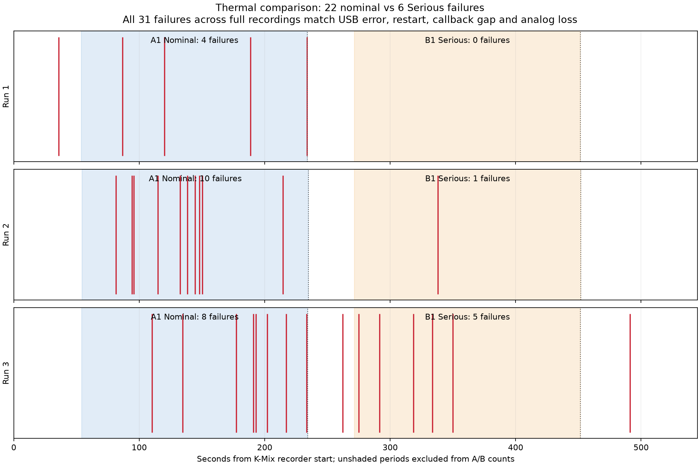
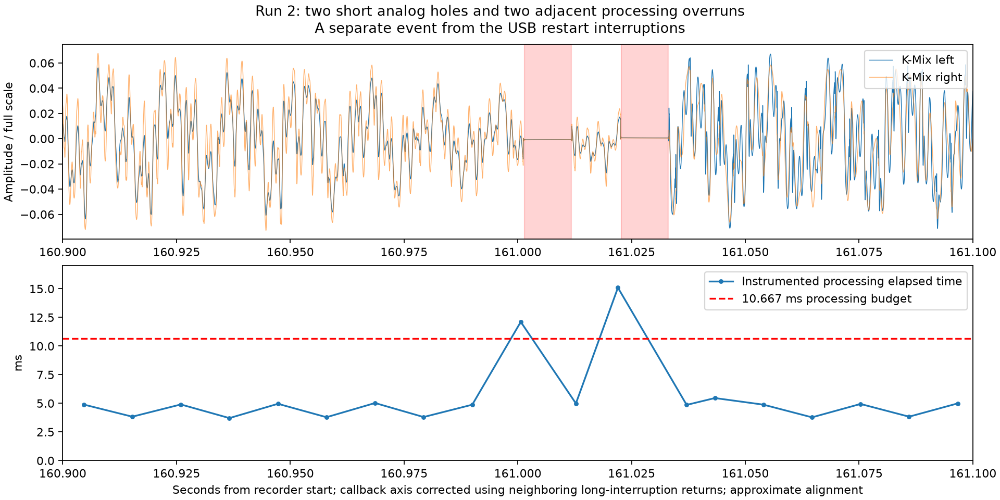

# September 10: induced thermal policy crossover with PD connected

## Authorization and hypothesis

The user approved running the nominal → induced Serious → nominal experiment unattended while away for several hours, with PD connected. Hypothesis: a consequence of elevated iPadOS thermal policy can reduce the audio failures without requiring physical warming. This does not distinguish scheduling changes from reduced electrical demand by itself.

## Fixed configuration

Same installed JUCE 8.0.15 diagnostic binary (SHA-256 a9902d35b72d13556c831daa1c30c71eb6b7429cf76408e35042952483a5f873), normal DSP/UI/autoplay/MIDI worker enabled, requested and verified actual 48 kHz/512 frames, zero app inputs/four outputs, saved ms patch and configuration hashes unchanged. PD, hub, MAYA, WB, and radio settings remain as provided. No source or installed app changes.

## Predeclared sequence

Up to three replicates, each with A1 → B1 → A2 → B2 → A3 in one continuous audio session. A means override off and actual nominal; B means ThermalSerious enabled and actual Serious. Each phase has 180 seconds of exposure after at least 30 seconds of transition settling and state verification. Allow at most 90 seconds to reach the target state. The relatively short blocks aim to make reversal possible before natural warming removes the nominal condition; one clean block is not proof of benefit. Repeat contrasts and retain both positive and negative outcomes.

Later replicates begin with ten minutes of passive cooldown with SmartGrid stopped. Initial preflight showed a stale callback trace inactive for over twelve minutes, so first attempt proceeded directly to a verified nominal launch. A failed setup attempt added approximately two minutes of playback before the corrected runner; its launch still verified nominal. Do not describe the first corrected run as untouched room-temperature hardware. Full sequences take approximately 75 minutes in total; hard runner limit is two hours.

If an off condition cannot return to nominal, or actual thermal state changes within a phase, mark the comparison incomplete and cool before a later replicate. Do not treat physically hot Serious-with-override-off as nominal. No Critical profile is activated. Critical actual thermal state, route/rate/frames departure, missing MIDI worker, disconnected PD, lost control connection, or stopped callback progress ends the run. Conditions are cleared and playback stopped during cleanup. Thermal override state must be verified clear at completion.

## Recording and monitoring

K-Mix analog inputs 3/4, 48 kHz stereo 24-bit, one continuous WAV per replicate, including marked startup and transition exclusions. The recorder has its own 30-minute bound per replicate. Initial signal gate requires five seconds of captured signal above -65 dBFS RMS; WAV growth and format are checked. Current settings produce approximately -31 dBFS RMS.

A single authenticated Wi-Fi pairing/heartbeat and developer connection remains open throughout all phases. Each 30-second sample reads a bounded 64 KiB app-log tail, battery connection/charging state, and active condition list. Sampling traffic is identical across A and B, and each query's start/end is retained. This differs from older recordings with no device service traffic; compare the repeated within-session contrast and score events near probes separately. Archives and whole app-log retrieval are excluded from measured intervals. No extra device polling or screenshots during the sequence.

After each replicate the app log is saved locally. After all playback finishes, collect the iPad system archive promptly for the preceding two hours. Verify actual retained log coverage; missing history is a limitation, not zero transaction failures. Match app callback timing, USB transaction errors/restarts, analog long interruptions and periodic holes. Validate actual thermal state continuously from the saved callback trace, not only the 30-second probes. Derive exact observation masks from phase timestamps and callback thermal state. Native xr is not a direct processing-overrun counter.

## Execution state and evidence

Authoritative corrected runner root: `/private/tmp/smartgrid-thermal-crossover-v2-20260910`.

- `status.json`: atomic current state, replicate/phase records and termination status.
- `events.jsonl`: exact intervention, sample, phase and cleanup timestamps.
- `r1`, `r2`, `r3` artifact bases: WAV, recorder metadata, host system log, startup verification and complete app trace when finished.
- Runner: `/private/tmp/smartgrid_thermal_crossover_20260910.py`; process output `/private/tmp/smartgrid-thermal-crossover-v2-20260910.runner.log`; exec session 44989.
- Initial failed setup: `/private/tmp/smartgrid-thermal-crossover-20260910`, preserved separately. Two independent pairing heartbeats disrupted the developer connection. It never enabled a thermal override; its 41-second capture is a failed setup, not a thermal comparison. Corrected runner shares one underlying paired connection, and initial read-only sampling succeeds.
- Initial locked-device preflight required one user unlock, now completed. PD and charging were both active at corrected launch; do not assume charging remains on throughout.

Current status: normal DSP launched at 18:13:13 PDT, PID 20643, initial nominal thermal state, K-Mix recording in progress. Scheduled follow-up will inspect local runner health and analyze completion without interfering with its live device connection.

Follow-up automation `track-thermal-audio-crossover` is active every five minutes, quiet during normal progress. Controller wrapper PID35351. The executed controller source is copied into the evidence root and hashed in the manifest.

## First replicate interim review, 18:25 PDT

The runner finished r1 normally as an incomplete crossover and began the planned passive cooldown for r2 at18:22:16. K-Mix captured542.037333seconds without recorder errors. Complete app trace has50,010callbacks and no sequence holes/logger misses. Measured A1 (18:14:05.078–18:17:05.310) is continuously nominal at48k/512, with four callback stalls and no measured DSP overrun. Measured B1 (18:17:42.639–18:20:42.827) is continuously Serious at48k/512, with no callback stall or measured DSP overrun. The override was cleared at18:20:42.827 but actual state remained Serious through the90-second verification window; A2 was unavailable. Do not claim reversible improvement or establish physical warming as the reason for the failed reversal; policy hysteresis is also unresolved. Later repeats remain planned.

Five post-startup analog long-interruption candidates correspond to five callback stalls across the full record; one is before measured A1, four in A1, none in B1. USB correlation awaits the final archive. The last A1 stall returned18:17:05.040, before the condition command at18:17:05.311; preserve this boundary distinction. No dense periodic episode was detected;14sparse short flat candidates do not establish an absence of subtle clicks. Local intermediate artifacts and `r1.preliminary.json` are retained under the controller root. No additional iPad query was made by the heartbeat. Use `/opt/homebrew/bin/python3.14` for the SciPy-dependent flat detector; the device-tool virtual environment only has NumPy via its analysis path.

## User theory to test during final analysis

The user proposes a common evolving timing error: small derivative leads to periodic corruption, large derivative to failure/reset. [Archived-data audit and specific predictions](research/2026-09-10-drift-derivative-hypothesis.md). After collecting the archive, compare within-IO-epoch drift slopes/steps and zero-length events across nominal/Serious states, and their ordering relative to USB failures. Do not infer zero derivative from no logged drift. The hypothesis adds analysis only; current experiment controls remain unchanged.

## Second replicate interim review, 18:48 PDT

R2 recorded542.122667seconds without recorder errors. Its measured nominal block (18:33:10.925–18:36:11.140) has10callback stalls, matched by10analog long-interruption candidates; the measured Serious block (18:36:47.918–18:39:48.231) has1callback stall and1analog long-interruption candidate. Full selected callback traces verify the respective thermal states continuously and48k/512, without sequence holes/logger misses. Nominal has two measured processing overruns (max15.095ms); Serious has none (max5.205ms). Sparse short candidates include two in second161 of the WAV, which deserve local waveform/timing inspection, but the dense periodic detector reports no episode. USB correlation remains pending. The app monotonic/wall fit residual is13.5ms, so final alignment should inspect anchor changes instead of assuming the submillisecond fit of r1.

After clearing the condition, actual thermal stayed Serious through90seconds, making A2 unavailable again. R3 began its ten-minute passive cooldown at18:41:21.599 and is expected to launch around18:51:22. Combined measured blocks so far:14long callback/analog interruptions in about6minutes nominal versus1in about6minutes inducedSerious. These are two sequential A→B contrasts without successful same-session nominal reversal, not a randomized rate estimate or a demonstrated fix.

## Latest authorization

The user accepts the missing reversed-order/nominal-return caveat and explicitly authorizes continuing directly to final log analysis and a focused nominal/Serious system trace. Do not require a Serious-first comparison before those steps. All three runs completed19:00:27 with conditions clear and SmartGrid stopped. The final archive collected19:03:30–19:04:19 contains968files/253,508,471bytes. Third run measured callback stalls8nominal versus5Serious, making total22versus6over equal approximately9-minute exposures. Full USB/power/drift analysis is in progress. Audio System Trace and System Trace templates are installed, but native xctrace lists the Wi-Fi iPad offline; the already working authenticated DVT connection has kernel tracing services to check. No native trace has been started yet.

## Final correlation, September 10, 19:24 PDT

All three runs are analyzed. The final archive covers the entire corrected experiment and the subsequent nominal return. No original recording or log was deleted. [Complete results](summaries/thermal-crossover-final-20260910.json), [short-hole/clock details](summaries/thermal-crossover-extras-20260910.json), and [SHA-256 artifact index](summaries/thermal-crossover-artifacts-20260910.json).

| Run | Nominal, 180 s | Induced Serious, 180 s | Full recording |
| --- | ---: | ---: | ---: |
| 1 | 4 | 0 | 5 |
| 2 | 10 | 1 | 11 |
| 3 | 8 | 5 | 15 |
| Total | 22 | 6 | 31 |

Each count is a matched MAYA endpoint0x82 transaction error, audio I/O restart, approximately217–226ms callback gap and analog interruption. Measured exposures are540.647seconds nominal and540.678seconds Serious. The observed ratio is3.67:1; it is not a randomized causal rate estimate. The third run substantially weakens the earlier14:1 impression. Serious does not prevent the fault. Sequential order, short bursty exposures and missing same-session nominal return remain unresolved. The user accepts proceeding without another reversed-order prerequisite.

All measured callbacks stayed48k/512 and in their intended thermal state, with MIDI worker enabled/running, no callback-sequence holes and no logger misses. Instrumented DSP median approximately4.3–4.7ms; no measured processing overrun immediately before the matched USB failures. The measured region excludes trailing callback logging and surrounding native/framework work. Four of31failures occurred within1second of a monitoring query; this does not suggest that every failure was directly triggered by a query, and does not establish zero observation effect.

No dense sustained periodic-blanking episode was detected. Run2 nevertheless contains two clear approximately10.3ms flat holes,21.333ms apart, associated with callbacks14210and14212 taking12.111and15.095ms against a10.667ms budget. Native xr stays9. Device-log times alone have a recording offset: independently matched neighboring long-interruption returns imply approximately−123ms local correction. This aligns the two overruns and holes; the correction includes recorder startup latency, independent clock drift and analog settling, so it is not sample-perfect proof. The global wall/monotonic linear fit has13.5ms residual in run2; the final analyzer interpolates per-second anchors instead. Preserve this short two-hole event separately from the long USB-restart failures and from the detector's dense-episode count.

Charging was already off throughout the measured nominal and Serious blocks in runs1and3, and changed within run2nominal. External power stayed connected. Stopping battery filling therefore cannot explain all differences. Screen brightness stayed constant in runs1and2; run3fell from600000to400000 by18:54:18.989, about57seconds before the Serious command, with the cause unestablished. Raw battery-temperature ranges differed and describe neither hub nor MAYA temperature.

Pressurelevel20 appeared6–7seconds after each Serious command. After clearing the override, pressurelevel0 returned239.43,239.02and228.75seconds later. The90second return budget was too short for these observed responses. This does not prove physical warming caused the unavailable reversal: policy persistence/simulation ramp and natural cooling remain confounded, and the app was stopped before each eventual return.

Nominal blocks had112,52and10ioDriftNS records and0,3and4zero-length-transfer reports. All measured Serious blocks had none of either report, while retaining6USB failures. Absence of drift reports is not zero derivative. Within single I/O epochs, nominal ramps include approximately0.077and0.146ms/s; the multi-run record does not demonstrate that Serious directly stopped those ramps. Run2drift ceased about2minutes before induction and run3more than1minute before it; run1's final reset preceded the Serious command. These facts weaken a simple thermal-switch/drift-derivative account. Private drift semantics and event-driven reporting remain limits.

## Authorized next step: focused native timing trace

The installed Audio System Trace template is available, but native xctrace still lists the Wi-Fi iPad offline. The authenticated DVT connection successfully captures kernel scheduler, workgroup and USB-class events plus an initial process/thread stackshot. This is a raw native kernel trace, not a claim that the full Instruments Audio System Trace track set is available. USB event argument meanings require additional decoding; the unified log remains the transaction-error authority.

An all-event trace fell behind the Wi-Fi transport. Filtered scheduler/workgroup/USB capture with post-stop draining now retains19.722seconds from a20second capability test, without TRACE_LOST_EVENTS markers. Initial trace headers have nonzero page padding; the offline decoder aligns the v2 thread-map header to4096bytes and preserves CPU IDs. Kdebug trace times will be anchored through the initial stackshot and app mach/wall anchors, not cached connection wall time. Capability captures were performed with SmartGrid stopped and without a thermal override; they are not audio outcome comparisons.

Next capture: unchanged normalDSP/UI/MIDI build and48k/512, K-Mix3/4 recording before launch, initial nominal verified, one90second filtered trace; drain fully, verify continuing nominal state, induce Serious, wait at least30seconds and verify actual state, then the same90second trace. Keep playback continuous between states. Profile setup/draining/transition traffic is excluded from traced exposure; no app-log/battery queries during the90second kernel acquisition itself. Read full app trace and collect the system archive afterward, clear the override and stop playback. Purpose: identify runnable delays, waits, CPU execution and driver-event ordering around individual failures; no clean short trace constitutes a fix. Both captured states have the same profiler configuration, but profiling overhead is a new observation condition. Trace byte limit1.5GB per capture, bounded drain90seconds and overall20minute limit. Abort/degrade interpretation on missing trace coverage, lost-event records, route/rate/frame/state departure or silent capture.

## Follow-up completed

The authorized native comparison is complete. [Final native report](2026-09-10-native-system-trace.md) supersedes the planned90-second capture details above: transport throughput required two fully retained10-second bursts per state. A sporadicUSBfault was captured while audio was already waiting; UI/MIDI starvation is not the immediate explanation for that event. No further comparison or source change is running.
