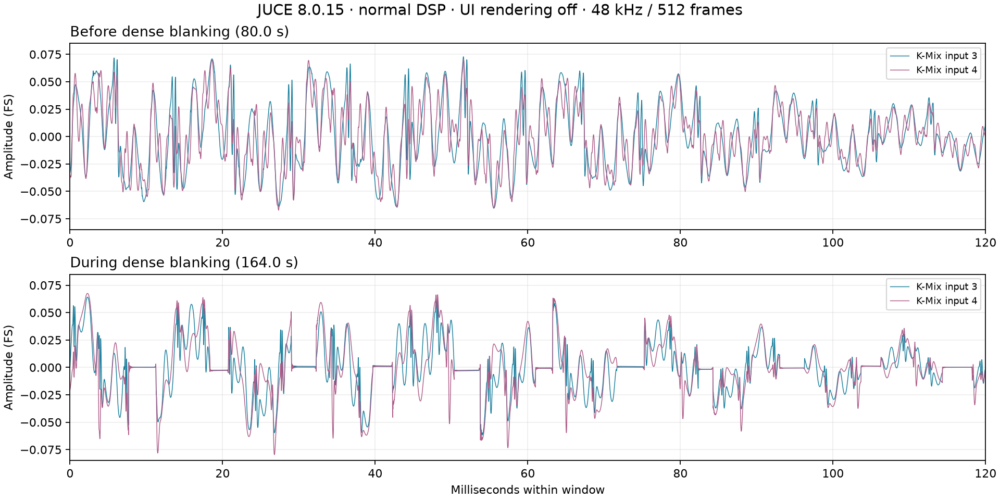
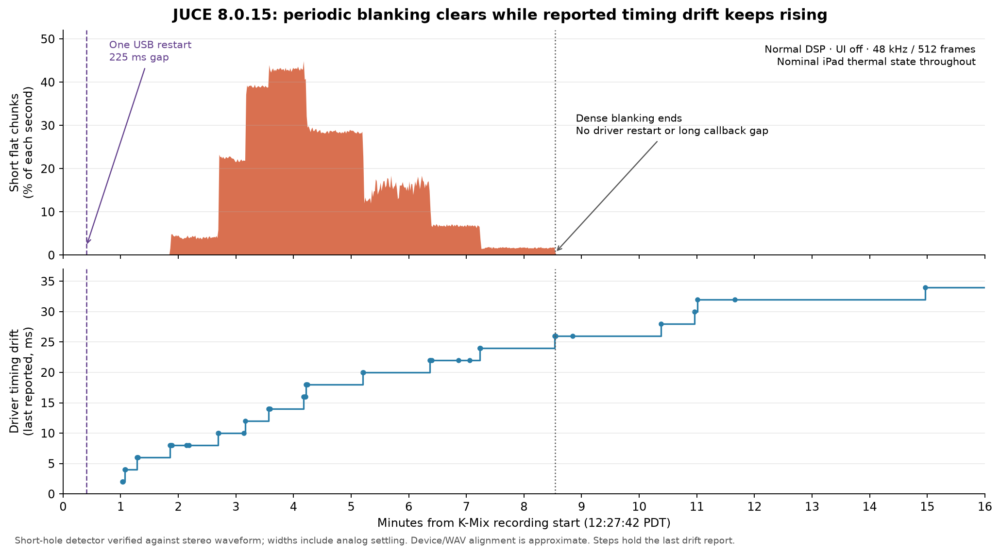

# JUCE 8.0.15 iPad comparison — September 10, 2026

Status: **comparison complete; both symptoms persist on JUCE 8.0.15.** The signed build passed independent reviews and was installed in place over Wi-Fi. The measured UI-on exposure was 168.192 seconds, stopped after positive reproduction; UI-off completed 960 seconds. Both were at nominal iPad thermal state. Normal visible UI/autoplay and the original general Wi-Fi connection preference were restored afterward.

## Permanent baseline

User clarified during this recording:48k request/guard and512-frame request are lasting requirements to carry into main, independent of the investigation outcome. They remain fixed in all variants, including old-JUCE controls. This experiment does not test removing them.

## Hypothesis and controls

Test whether the newer JUCE setup and hardware-query sequence prevents either established symptom. Preserve normal DSP/MIDI/workers/logger, 48 kHz / 512 frames, zero app inputs/four outputs, saved ms patch/internal clock, MAYA + WB + hub topology, Wi-Fi on/Bluetooth off, and K-Mix inputs 3/4 at 48 kHz/24-bit. Compare UI on, then UI off. Keep device service traffic outside each measured window. Count long restart interruptions and periodic partial-buffer holes independently.

JUCE 8.0.15 is pinned to 91ad83ae34a81e0833b1a2b0866f54846370ae53 under /private/tmp/smartgrid-juce-8.0.15. The shared 8.0.2 source and old signed IPA remain intact. The only new local native patch sets defaultBufferSize from 256 to 512; modern iOS exact-duration handling is upstream. Full module upgrade includes the headless audio-processor dependency and split GUI translation units. No application compatibility edits beyond the startup version marker were required.

The native process(...) region is identical between these versions. Setup changes include iOS18+ activation waiting for a temporary RemoteIO callback, skipping active buffer-range probing, and applying target preferences before querying hardware. Both old and new already select Playback for zero requested inputs, with temporary PlayAndRecord during discovery. A successful version comparison would not isolate a specific commit or exclude changes elsewhere in JUCE.

## Build and data identity

- Worktree: /Users/joyo/.codex/worktrees/e18e/theallelectricsmartgrid, codex/audio-diagnostics-48khz; uncommitted diagnostic prototype.
- Build log: /private/tmp/smartgrid-juce815-ios-build.log — BUILD SUCCEEDED.
- Signed product: /private/tmp/smartgrid-juce815-ios-product/SmartGridOne.app.
- Package: /private/tmp/smartgrid-juce815-20260910.ipa; SHA256 5dcb7076ed7a2a675e8fd641c1f60321854060514faa4810b1db6bf325c2e9b6.
- Binary SHA256: 4f7b9428c5e8c4b91e658c7f8d7b8441ba7f5c1a5cd46f5e8f9fd16d6d0e4df5.
- Strict and deep signature checks passed outside restricted sandbox; no trust settings changed.
- Dependency provenance: 25 files reference pinned modules, six reference generated audio_devices, none reference old shared modules; generated native delta is exactly the prescribed substitution.
- Pre-install config SHA256: 1a57b9b6404191b86e85b7f1c50b8e5ebbef7d8cad072a6e5234b367c805b9ec.
- Saved patch SHA256: a0e797a87de665e300dcf8ff484774ee93639c8c7d425a67ddc0aabb2223952a.
- General paired Wi-Fi connection preference was re-enabled before deployment preparation and restored false at 12:47:46 after the experiments; Wi-Fi radio and wireless debugging remained on.

## Runs

### First startup / thermal exclusion

First launch12:14:37, app log2026-09-10T12-14-37-571.log. Correct version, normal/UI-on/autoplay, MAYA48000Hz/512 reported, app inputs0/outputs4, unchanged config/patch hashes. First two callbacks had470 frames; the next500 in the initial read were512. The first measured DSP duration was19.309ms during initialization. The initial automation gate rejected any startup size variation; before further launches it was refined to require200 consecutive actual512/48k callbacks immediately before measurement, while retaining all startup frame sizes. This does not discard startup behavior.

iPad thermal state was2 (serious). A2MB tail of the preceding old8.0.2 app log shows137 consecutive thermal anchors at2 from12:11:48 through12:14:05, establishing that the state preceded the upgrade. Earlier measured UI comparison runs were nominal, and already reproduced both symptoms.

A10-second K-Mix preflight at12:15:49.781 had music around-30/-32dBFS RMS, no long silence candidates and no short flat candidates. This is not a controlled negative trial. Raw base:/private/tmp/smartgrid-ipad-juce815-hot-startup-preflight-20260910. Current app log/config/patch were preserved. SIGTERM to verified PID18087 closed the service connection before its response; a fresh read confirmed no SmartGridOne process at12:17:48. Cooling pause, topology unchanged. Startup system archive retained separately.

### UI-on measured run — completed

Base:/private/tmp/smartgrid-ipad-juce815-ui-on-r2-20260910. Launched12:20:55 after cooling; verified JUCE8.0.15 normal/UI-on/autoplay, MAYA48k, input0/output4, same config and patch. First startup buffers included470 then512; final200 consecutive startup callbacks all512/48k and thermal0 (nominal). Screenshot shows normal active UI. Ten-second preflight confirmed music around-30/-32dBFS RMS with no long silence candidates.

Measured recording12:21:52.296408–12:24:40.488408 PDT, exact168.192seconds. Stopped early after clear positive reproduction, per plan; do not compare raw counts as equal-duration rates. No device file/archive/screenshot traffic during measurement.

Five analog interruptions222.833–229.854ms (median225.542ms), all matched individually to five kernel MAYA transaction errors, five driver restarts and five app callback gaps217.546–225.218ms. All15,669 measured callback records were512frames/48000Hz, thermal0, low_power0 and unmuted, with no missing sequence records or logger misses. Measured DSP median/p99/max3.912/4.978/5.135ms, zero measured overruns. Native sample-timestamp discontinuity counter1→6. Five isolated short flat candidates and no dense periodic episode; this short run does not exclude periodic corruption. No zero-length-transfer reports or ioDriftNS records in the measured interval. Wave/device event offsets are approximately101–107ms from recorder/clock alignment, not measured causal latency.

### UI-off measured run — completed

Base: /private/tmp/smartgrid-ipad-juce815-ui-off-20260910. Launched 12:26:28 with normal DSP/autoplay and UI rendering suppressed. Actual 48 kHz, final 200 startup callbacks at 512 frames, app inputs 0/outputs 4, nominal thermal, same config/patch; static UI-off screenshot verified. Ten-second preflight confirmed music. Measured recording 12:27:42.439342–12:43:42.439342 PDT, exactly 960 seconds. No iPad service traffic during measurement.

One analog interruption, 224.8125 ms at WAV 24.1733125–24.398125 s, matches one MAYA endpoint 0x82 transaction error at 12:28:06.646462, one driver restart and one 224.799 ms app callback gap (callback 8530). All 89,975 measured callbacks were 512 frames/48 kHz, thermal 0, low_power 0 and unmuted. No sequence holes or logger misses. Measured DSP median/p99/max 4.613/4.945/7.706 ms, zero measured overruns. Native sample-timestamp discontinuity counter 4→5.

Dense periodic blanking begins at WAV 111.658667 s and ends at 512.347771 s: 400.689 seconds, about 6.68 minutes, with 26,575 short holes. Median/p99/max hole width 3.042/7.104/9.188 ms; peak flat fraction 44.629% in one second. Another isolated short candidate later is not attributed as a fault. Early spacing is approximately 21.333 ms with 0.9 ms widths, progressing to 10.667 ms with roughly 4.1 ms widths, then more complex 8/32 ms cadence and declining widths. Both channels contain the holes; the waveform was visually inspected.

The interval contains 34 zero-length IN transfers in 27 reports and 44 ioDriftNS reports. Drift is near 8 ms around onset and reaches 26 ms near recovery, then continues rising to 34 ms while the output remains free of another dense episode. The final holes clear without another USB restart or callback gap. Thus accumulated driver drift is associated with the periodic state, but a simple monotonic “more drift means more destroyed audio” model does not fit this run. A phase/alignment mechanism remains possible; the private drift field is not a direct lost-output-sample count.

### Startup and out-of-window events

The UI-on repeat has one additional transaction error just before recording (12:21:51.835329) and one after recording (12:25:10.732466). UI-off has four pre-recording transaction errors: 12:26:39.156122, 12:26:59.826909, 12:27:10.138828 and 12:27:40.618624. They are retained in each error-partition summary. Excluding them from the steady recording does not mean the launch was error-free.

The UI-on app log has only its startup prepareToPlay and consecutive callback IDs across the five measured driver interruptions. A successful JUCE Pimpl::restart would issue aboutToStart and reset this app's sequence. Therefore the observed driver restart chain should not be described as JUCE's message-thread reinitialization path.

### Restoration

After collection, normal DSP/visible UI/autoplay was restored on JUCE 8.0.15, PID 18312, log 2026-09-10T12-45-51-978.log. Runtime marker, MAYA 48 kHz, settled 512 frames, zero app inputs/four outputs and unchanged config hash were verified. A 10-second post-test K-Mix recording at 12:46:39.665767 confirmed music but contains one additional long-silence candidate at WAV 3.363–3.500 s. It is retained outside the comparison and was not correlated to an iPad archive; restoration is not a clean-audio claim. No recording or device collection remains active. The general paired Wi-Fi preference was restored false at 12:47:46 and read back false again during the later battery query.

## Interpretation

The upgrade did not remove either symptom. Every measured long interruption in both conditions matches a USB transaction error, driver restart and callback gap. Periodic holes persist with continuous app callback sequence, nominal iPad thermal state and short measured DSP time. The conditional old-version positive control and hour-long extension were not triggered, because the new build reproduced both failures.

| JUCE / UI | Measured seconds | Matched long interruptions | Dense periodic holes |
|---|---:|---:|---|
| 8.0.2 / on | 382.549 | 17 | Brief burst |
| 8.0.2 / off | 960 | 1 | Two sustained episodes |
| 8.0.15 / on | 168.192 | 5 | None in this shorter exposure |
| 8.0.15 / off | 960 | 1 | 400.689-second episode |

UI-off has fewer steady-state sporadic interruptions in both sequential comparisons, but is not immune. Relaunching changes audio-driver state, events are bursty, durations differ, and UI-off startup errors remain substantial. This is a repeated association, not a randomized causal rate estimate. Both UI-on early stops followed clear positive reproduction; they were not equal-duration trials.

## What the UI source audit establishes

Completed read-only reports: [JUCE coupling](research/2026-09-10-juce-ui-audio-coupling.md) and [app state/rendering work](research/2026-09-10-app-ui-audio-sharing.md).

UI-off hides children and suppresses repeated display-mode/CPU-label/repaint work. It retains the 16 ms timer, state interchange, logger drain, platform polling, DSP, MIDI workers and display-state production. CPU-meter reads are atomic; normal repaint does not acquire an audio lock or change the audio session. No paint-held application lock or display-queue backpressure into audio was identified.

The observed Source/VCO page adds substantial work: up to three 1024-point FFTs per paint, 21,504 scope points, three filter responses, repeated path construction, and up to 10,240 pow evaluations from rebuilding log lookups, including on linear scopes. These are source-level upper bounds, not measured paint frequency or CPU consumption. Eight 128 MiB scope histories provide 1 GiB addressable storage, not 1 GiB copied each frame; audio-side history production remains enabled with UI off. Shared CPU/memory scheduling and power demand are plausible indirect connections, not established causes of the first USB error.

JUCE route/format reconfiguration can run through the message thread, so UI work could delay that recovery path in principle. The observed driver interruptions lack corresponding app reinitialization, weakening that explanation for these events. The native callback's input AudioUnitRender is skipped with zero active app inputs. Its try-lock failure path zeros a whole output buffer and skips the app callback, which does not match the observed regular app callbacks during partial-buffer corruption.

Existing dsp_us ends before device/xrun queries, formatting/enqueue and outer JUCE/native work. Zero measured DSP overruns is not proof that the full callback always met its deadline. The native xr counter measures sample-time discontinuity, not DSP execution overruns.

## Next discriminators

The user's [PD power/heat hypothesis](2026-09-10-hub-power.md) is now a concrete hardware control. Preserve 48 kHz/512 and normal workload. A repeated PD-on/off comparison changes the power source; cooling only the hub while retaining power/data connections better separates hub heat from power-path changes. For UI causality, alternate UI state within one continuous audio session before further splitting live FFT/scope calculations from frozen-data drawing. Native entry/exit and output-sample boundary tracing remains the next software discriminator; the version comparison does not authorize presenting any untested code path as a fix.

## Evidence and limits

Compact per-run callback, correlation, periodic, startup, restoration and provenance summaries are under summaries/. Large WAV files, app logs and system archives remain at the raw bases above, enumerated by evidence-manifest.json. Analysis helpers and both reviewed waveform figures are preserved here. Sample timing uses a conservative event-matching neighborhood and recorder/clock alignment; roughly 0.1-second offsets are not causal transport delays. Flat detectors identify candidates; dense periodic attribution was checked in the raw stereo waveform and cadence. Subtle isolated clicks are not excluded by these detectors.
