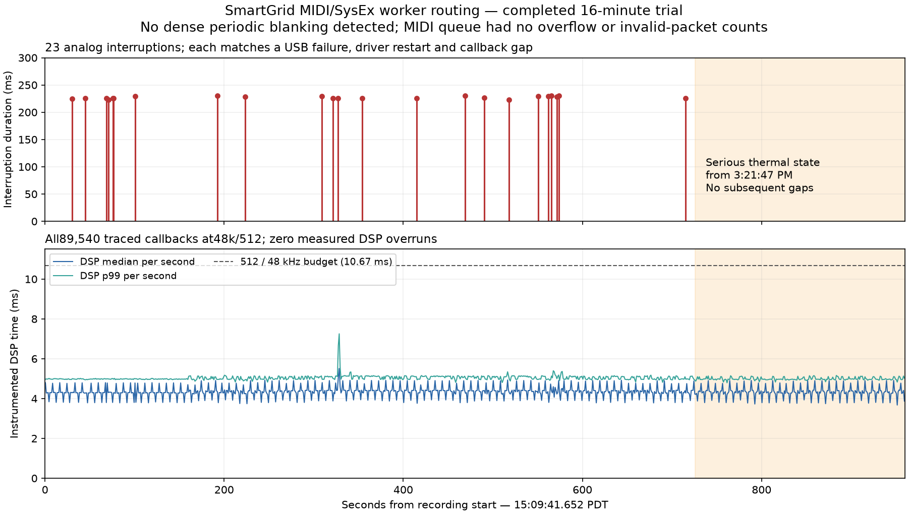
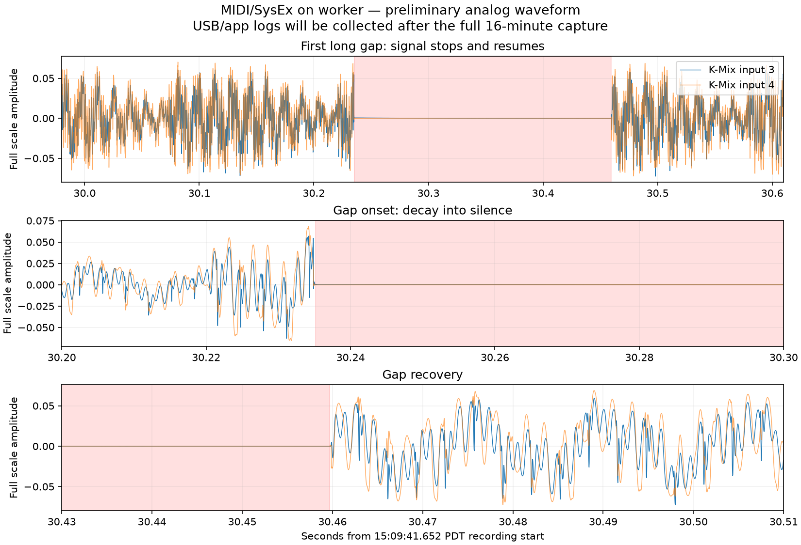

# MIDI/SysEx submission on the existing worker — September 10, 2026

Status: **completed and analyzed**. The960-second capture ran **15:09:41.652–15:25:41.652 PDT**, with recorder return0 and empty stderr. Source tests, task review, final integration review and measurement review passed. Sporadic failures persist; no dense periodic blanking was detected in this exposure.

## Completed result

| Observation | Worker-routed MIDI/SysEx, 16 minutes |
|---|---:|
| Long analog interruptions | 23 |
| MAYA transaction failures / driver restarts / callback gaps | 23 / 23 / 23 |
| Unique one-to-one matched episodes | 23 |
| Refined interruption duration, min / median / max | 222.56 / 226.08 / 230.71 ms |
| Dense periodic blanking episodes | 0 detected |
| Isolated short flat candidates | 16; no dense clusters, not all established artifacts |
| Native sample-timestamp discontinuity counter | 0 → 23 |
| Callbacks / sample rate / delivered frames | 89,540 / 48 kHz / 512 |
| Instrumented DSP time, median / p99 / maximum | 4.712 / 5.120 / 7.273 ms |
| Measured DSP overruns / trace sequence holes / logger misses | 0 / 0 / 0 |
| SysEx enqueued and submitted between sampled edges | 39,919 each |
| Sampled SysEx queue depth / explicit full, invalid, disabled discard | 0–2 / all 0 |
| Driver zero-length transfer reports / transfers | 1 / 2 |
| Driver ioDrift records | 5 |

All23 analog interruptions match distinct MAYA input endpoint0x82 transaction errors, driver restarts and long native callback gaps. This reproduces the prior sporadic failure mechanism with normal frame MIDI/SysEx no longer submitted directly by the audio callback. The driver events establish the recovery chain, not its initiating cause. Moving MIDI remains a reviewed long-term improvement; it has not fixed these interruptions. No dense periodic damage was detected during this16-minute exposure, but one quiet exposure for that symptom is not sufficient to claim it fixed.

The worker remained enabled/running across955 diagnostic observations. SysEx cumulative enqueue and handler-submission counters advanced2333→42252, with all explicit overflow/invalid/discard counters zero. Approximate sampled occupancy reached2 of64 slots; it is not an exact high-water mark. Handler-call completion is not a physical device acknowledgment, and independently sampled counters need not match within an arbitrary single log line. Basic queue sampled depth was0–5.

### Thermal condition changed late in the run

The iPad was nominal until the app sampled **serious state at15:21:47.326**, then serious for the remaining234.33seconds. All23 long failures occurred before that transition; the final analog gap ended around15:21:37.196. No further long failures were detected afterward. This ordering does not establish heat as the cause or a remedy. It also prevents treating the full exposure as thermally matched to the preceding all-nominal MIDI-off run.

The retained system archive independently records thermalmonitord pressure level20 at15:21:47.026 and an audiomxd thermal-pressure policy message at15:21:47.027, including disengagement of its Thermal mxCoreSession. This is a scheduling/policy lead for later investigation, not evidence that a specific mitigation fixed audio. The internal pressure label Moderate and app NSProcessInfo enum Serious are different scales. This telemetry is from the **iPad**, not MAYA or the hub. App mapping is the direct NSProcessInfo thermalState value in AudioPlatformDiagnostics.mm; the SDK enum confirms2=Serious. The state is sampled on the low-rate message timer, so app observation follows the OS event by about299ms.

### Comparison and limits

The preceding MIDI-worker-off exposure had39 matched long failures and a12-second periodic episode in960seconds, with all sampled thermal state nominal. The new version also re-enables that worker and its basic-message traffic, so those two runs are not a routing-only crossover. Differences in counts or absence of periodic damage cannot be attributed solely to moving SysEx. SonoBus remains a completed clean control at48k/256 rather than a matched512 buffer. SmartGrid's accepted48k/512 settings stay fixed.

The full trace contains no holes or logger misses, all callbacks are48k/512, and config/patch hashes remain unchanged. Maximum measured DSP time7.273ms is below the10.667ms budget, but the timed region excludes subsequent logging and outer JUCE/native work. Native xr counts timestamp discontinuities; it is not a DSP deadline flag. The monotonic/wall fit has14.352ms maximum residual. Reported callback-resume minus analog-quiet-end spans96.068–135.070ms; this is capture/clock alignment, not a causal transport latency. Correlation used the same conservative750ms neighborhood and verified23 distinct callback and waveform matches.

The independent measurement review caught a minor window-metadata label inconsistency: an inherited epoch-end field still described wrapper completion while the ISO end described the exact WAV window. The helper and derived window now separate nominal and wrapper timestamps; the original wrapper JSON and before-copy are preserved, ISO analysis bounds remain unchanged, and the nominal epoch interval is exactly960seconds. No outcome counts changed. [Measurement review](research/2026-09-10-midi-sysex-worker-measurement-review.md).

## Hypothesis and intervention

Direct `sendMessageNow` invokes the platform MIDI submission inline, and the existing WB/Launchpad callback paths constructed heap-backed JUCE SysEx messages. This work belongs off the audio callback. Moving it can remove callback allocations and CoreMIDI submission stalls; it is not proof that either caused MAYA's USB errors or periodic holes. The preceding [worker-off exposure](2026-09-10-midi-worker-off.md) reproduced both symptoms while direct audio-frame LED/SysEx sends remained active.

All normal audio-frame output now uses the existing MIDI sender: WB/Launchpad complete SysEx packets are copied into 64 preallocated slots of up to 2048 bytes, while Twister/K-Mix short-message bypasses enter the existing basic queue. The worker retains each SysEx slot through JUCE message construction and synchronous handler submission, then releases it. Full queues return promptly and reset the affected LED writer for retry. Disabled-worker mode deliberately discards before enqueue. Control-thread handshake/final clearing uses the synchronized handler; audio detachment and worker join precede final clearing and handler destruction. Existing worker scheduling and basic timestamp semantics are unchanged.

This is the enabled-worker variant, with normal DSP/UI, autoplay/internal clock, JUCE 8.0.15, zero app inputs/four outputs, unchanged ms patch and MAYA/WB/Satechi/PD topology. **48 kHz/512 is the permanent baseline.** Both sporadic interruptions and periodic partial-buffer blanking remain outcome measures.

## Build and startup evidence

- Implementation: [plan](historical-context/docs/superpowers/plans/2026-09-10-midi-sysex-worker.md); exact baseline snapshots and task reviews in the matching `.superpowers/sdd` directory. Source is uncommitted in the existing diagnostic worktree. Main and shared JUCE are untouched.
- Focused owned-queue tests: 5 cases / 2105 assertions passed. An actual third-observer depth race was reproduced, bounded, and followed by 50 passing concurrent repeats. No full unrelated DSP test run was added.
- iOS Release build: `/private/tmp/smartgrid-midi-sysex-ios-build.log`, BUILD SUCCEEDED; strict signature validation passed. Package `/private/tmp/smartgrid-midi-sysex-20260910.ipa`; metadata and source hashes in the matching `.package.json`.
- Binary SHA256: `a9902d35b72d13556c831daa1c30c71eb6b7429cf76408e35042952483a5f873`. IPA SHA256: `e1882fcb10404b35b5a56b1c1fde98dbc76a6d2934cf6f279b1e32bb2576ce85`.
- Authenticated Wi-Fi in-place Upgrade finished 15:04:10; config and patch hashes identical before/after. Launch PID 19365, log `2026-09-10T15-08-40-481.log`.
- Startup actual MAYA 48 kHz/512, app inputs 0/outputs 4, nominal iPad thermal, JUCE 8.0.15, normal mode/UI/autostart all verified. One startup callback was 470 frames; the last 200 verified callbacks were all 512 at 48 kHz. Preserve the startup exception separately from the later measured interval.
- Five successive MIDI samples: worker enabled/running, SysEx enqueued and submitted advancing from 8 to 173; SysEx queue depth 0, full/invalid/discard counts 0. Basic queue depth 3–5. Submission counts indicate calls to the handler, not physical hardware acknowledgments. No physical LED observation was available.
- Separate five-second analog preflight at 15:09:10: RMS -30.71/-32.08 dBFS, no near-silence candidates, capture return 0. This confirms audio presence, not a long-run fix.

## Measured capture and analysis contract

Run base: `/private/tmp/smartgrid-ipad-midi-sysex-worker-20260910`. K-Mix analog inputs 3/4, 48 kHz stereo 24-bit, completed960seconds. Wrapper PID 25992, SoX PID 25999, recorder exec session 46188. The wrapper self-stopped successfully. Autostart occurred about 57 seconds before the measured capture; startup and analog preflight remain separate evidence. No iPad service traffic or heavy builds during capture. No iPad service traffic occurred during capture. The archive was collected15:26:04–15:26:42,1038files/227,696,702bytes. The app trace was collected15:29:44 after one interrupted retrieval attempt; latest log identity and unchanged config/patch were verified.

After capture, verify exact duration/return status, preserve app configuration and matching log identity, decode iPad system timestamps explicitly, and correlate waveform gaps with MAYA transaction failures/restarts and native callback gaps. Score dense periodic short holes separately, inspect real waveform candidates, and verify the worker/queue counters throughout. SysEx depth is an approximate bounded sample. Logging cadence does not prove absence of brief queue occupancy. Timed DSP excludes logger and outer native work; xr means sample-timestamp discontinuity. An absence or reduction of one symptom cannot establish both fixed. Check shutdown/overflow/physical LED behavior before extracting a production patch; these runtime cases are not exercised by an ordinary music capture.

## Evidence and remaining production checks

Raw artifacts use the run base: `.launch.json`, `.startup.log`, `.verification.json`, `.png`, `.run-status.json`, `.json`, `.wav`, `.stderr.log`, and `.system.log` (the last is the Mac capture log). iPad `.logarchive`, `.app.log`, `.system.json`, waveform/callback/correlation/thermal analyses and `.result.json` are complete and retained. [Result summary](summaries/midi-sysex-worker-20260910-result.json). [Start summary](summaries/midi-sysex-worker-20260910-start.json). [Final integration review](research/2026-09-10-midi-sysex-worker-integration-review.md) approved code readiness with no blocking findings; task source review also passed. Full capture analysis and its independent review are complete. Physical MIDI delivery, forced-overflow convergence, saturated clock timing and graceful shutdown remain production-extraction checks, not claims made by this capture.

## Earlier preliminary waveform check — retained chronology

The first207.075seconds contain eight both-channel near-silence candidates. A separate flat-region scan through251.676seconds finds nine long gaps and five isolated short candidates, with no dense periodic cluster in that interval. The first gap was inspected directly: abrupt signal loss near30.235seconds, brief analog settling, then recovery near30.460seconds; its flat portion spans224.5ms. This confirms that long interruptions persist in the deployed worker-routing build. Driver/callback correlation awaits post-capture logs, and the periodic symptom remains unscored for the full exposure. Recorder identities match, audio levels remain near-31dBFS, and stderr is empty. No iPad service query was made.

## Next decision

No new experimental dimension has been activated. The next recommended probe is complete native RemoteIO callback timing and the outgoing sample buffer, which can expose work outside the existing DSP timer and show whether damage is already present at the final app boundary. Keep normal workload,48k/512 and the reviewed MIDI worker routing; log actual thermal state in repeated matched exposures. A thermal-policy comparison would need a deliberate repeatable design, not an inference from the quiet tail of this run. The remaining hub power/heat and SonoBus512 controls stay in the experiment queue.

The recording is complete and its heartbeat is paused. The reviewed build remains installed; no next variant has been deployed.

## Unchanged-session follow-up at15:46 — user reports a quiet stretch

At about15:44 the user reported hearing very few dropouts during roughly the preceding20minutes. A read-only Wi-Fi check at15:46 confirms the same PID19365, same launch log2026-09-10T15-08-40-481.log and unchanged config hash. No version, app state, or configuration was changed. Normal DSP/UI, JUCE8.0.15, MIDI worker enabled, and zero app audio inputs remain the deployed condition.

From15:26:04 through15:46:04, the112,503 logged callbacks all stayed48k/512 and unmuted, with no trace sequence holes, no gap over20ms, no new native xrun increment and no measured DSP overrun. Native xr remains23; its last increment was15:21:37. The MIDI worker continued operating with50,114 additional SysEx handler submissions between sampled edges and no queue-full/invalid events. The iPad remained in serious thermal state2 throughout. This supports the user's observation of a markedly quieter interval in the unchanged session.

The clean callback interval extends roughly24½minutes beyond the last interruption and follows the recorded thermal-pressure policy transition, but it does not prove heat/throttling or the MIDI change caused that improvement. K-Mix recording ended15:25:41; this follow-up is app-trace evidence only, so periodic analog damage and isolated audible clicks are not ruled out. No new recording, archive collection, relaunch or setting change was performed. [Follow-up evidence](summaries/midi-sysex-worker-followup-20260910-1546.json).

## Quiet-history extension at15:53

The current unchanged log now verifies32m09s without another xr increment or callback gap over20ms, through15:53:46. A newly retrieved complete older log also verifies35m08s of that behavior from11:38:58–12:14:06 on normal/UI-on JUCE8.0.2, before the SysEx change. Both intervals span an iPad nominal-to-serious thermal transition. The current last dropout also restarted the driver about ten seconds before thermal policy changed; thermal was not isolated. This earlier interval prevents crediting the latest build for a phenomenon that already occurred. Neither entire interval has analog coverage. [Detailed comparison](2026-09-10-thermal-quiet-history.md).
