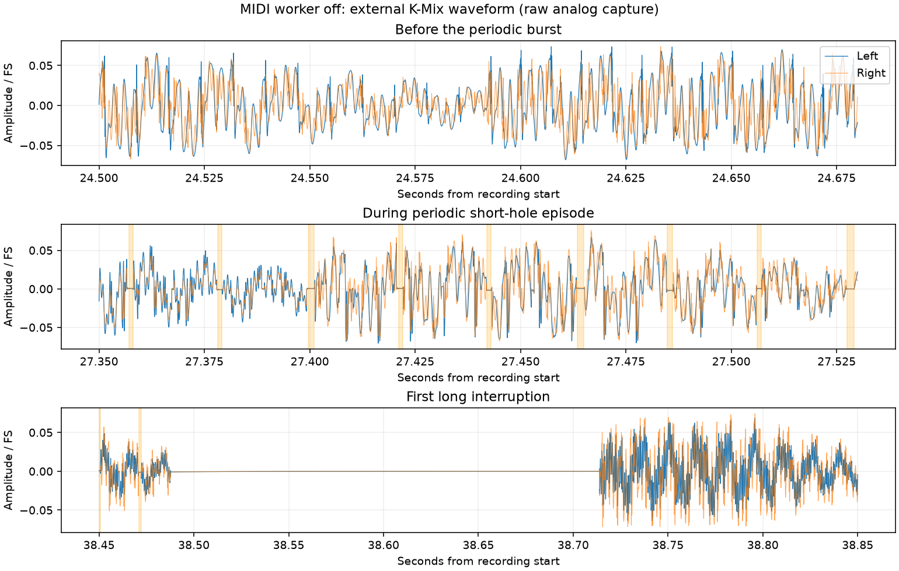

# MIDI send worker disabled — September 10, 2026

Status: **completed and analyzed**. Exact960second exposure14:36:12.275–14:52:12.275 PDT. Both symptoms reproduced:39 long interruptions matched39 MAYA transaction failures,39 driver restarts and39 callback gaps; a dense periodic burst spans WAV26.312–38.472seconds. The worker remained stopped and its queue empty. [Final result](summaries/midi-worker-off-20260910-result.json). The next user-selected change routes audio-frame SysEx/MIDI to the worker.

## Hypothesis and intervention

The user selected disabling the MIDI send worker and discarding enqueue requests before they fill its queue. A new immutable launch option, `SMARTGRID_MIDI_SEND_THREAD=0`, skips realtime-thread startup and drops/counts messages at the beginning of `SendMessage`, before route assignment or queue insertion. Default or1 retains the enabled path. This removes both wakeups and worker-sent MIDI traffic; a changed outcome cannot separate these effects yet.

Direct WB LED/SysEx sends, the I/O worker, normal audio processing, normal UI/visualizer, autoplay/internal clock, tracing and patch/config remain. Keep the accepted48k/512 baseline, JUCE8.0.15 and zero app inputs/four outputs. Hardware is the user's unchanged MAYA/WB/Satechi/90WPD topology. Wi-Fi stays enabled, Bluetooth disabled; no physical replug or power change was made by the agent.

## Preparation and validity checks

The exact source delta is29insertions/2deletions in MidiSender.hpp and one existing-timer call in MainComponent.cpp. A fresh implementation agent and independent task reviewer completed the source work; spec and source quality passed. Existing enabled queue depth is an approximate snapshot because its two counters are sampled independently. Disabled queue counters stay zero, so this limitation does not invalidate the discard check. Final integration review passed with no Critical or Important findings; source/package hashes matched and the existing enabled-queue snapshot limitation remains Minor. [Review record](research/2026-09-10-midi-worker-off-integration-review.md). [Plan and gates](historical-context/docs/superpowers/plans/2026-09-10-midi-sender-off-experiment.md).

The SonoBus control finished exact3,600seconds and its archive was collected before the new build or any device changes. SonoBus then exited(PID0 verified). The Release iOS build passed, signature verification passed, and in-place Wi-Fi upgrade preserved both configuration and patch hashes. Package `/private/tmp/smartgrid-midi-worker-20260910.ipa`; binary SHA256 `c1ab35fd9cd627798583aaa08ba40e12cabde0915acbcb0275b0d1ad32961fd6`. Prior signed packages remain available.

A separate enabled launch at14:33 verified realtime startup success and worker entry: `enabled=1 started=1`, repeated `running=1`, queue2–4, discards0. This establishes that disabling the worker actually removes an active path. This brief preflight is not a measured enabled dropout-rate control.

The selected disabled launch at14:34 verified `enabled=0 started=0 running=0 queued=0`, discards31→1,077 across startup samples; normal mode, UI on, transport autostart, internal clock, MAYA48k/settled512, app inputs0/outputs4, thermal0. Startup delivered470 then512frames; the last200callbacks were all512 at48k. The UI screenshot shows the normal scope page. AppPID19029, app log2026-09-10T14-34-05-533.log. K-Mix3/4 preflight14:34:37–42 showed sustained music near−30/−32dBFS RMS, no quiet candidates, recorder exit0.

## Capture and analysis plan

Raw base `/private/tmp/smartgrid-ipad-midi-worker-off-20260910`. The wrapper records K-Mix3/4,48k stereo24bit for960seconds and stops itself. WrapperPID24071, SoXPID24078, exec session33471; current metadata remains authoritative. Heartbeat `track-midi-worker-off-trial` monitors local recording state and collects/analyzes afterward, staying quiet on unchanged progress. No app queries, screenshots, archives or heavy builds during capture.

At completion verify exact WAV duration and capture errors, collect the iPad archive and the matching app log, and verify the patch/config and disabled worker/empty queue throughout the measured span. Analyze long interruptions and dense periodic short holes separately using the same waveform methods as prior runs. Match events to MAYA transaction errors, driver restarts and native callback gaps; record zero-length transfers and drift separately. The waveform-to-log alignment is approximate; repeated error messages are not distinct interruption counts. Timed DSP excludes subsequent logger/outer native work, and native xr counts timestamp discontinuities.

## Interim observation

A local scan through157.013seconds found both-channel near-silence at WAV38.550–38.713,75.571–75.718,122.325–122.457,129.664–129.789 and140.978–141.184seconds. These irregular125–206ms gaps are surrounded by strong signal. They were reported to the user at14:39; continue the planned exposure to observe periodic damage too. No iPad logs were collected to correlate them during the run. This evidence shows the disabled condition still has analog interruptions; it does not yet identify their driver or callback cause.

## Final outcome

All39 measured analog interruptions correspond one-to-one with MAYA transaction failure, driver restart and native callback gap. Refined full durations are216.65–229.85ms(median225.67ms); the earlier125–206ms numbers were only the below−75dBFS cores, which omit analog settling. A separately inspected periodic burst contains578 short holes over26.312–38.472seconds, with about21.33ms onset spacing and1.08ms median width. The whole file contains609 short candidates; sparse isolated candidates outside the burst are not all established glitches.

The954 once-second MIDI observations all show enabled0/running0/queued0, with monotonic discards31,407→278,802. The89,229 captured callback records have no sequence holes and remain48k/512, thermal0, low-power0 and unmuted. Instrumented DSP p50/p99/max is4.079/4.938/5.376ms, with0 measured DSP overruns. Native timestamp discontinuities advance0→39. System logs also report7 zero-length-transfer records totaling10transfers, and65 ioDrift records.

The periodic burst ends just before the first long analog interruption, consistent with the previously observed reset/masking pattern; this does not prove a shared initiating cause. Callback-resume timestamps are137.9–152.0ms later than corresponding analog gap ends under nominal wall-clock alignment. Treat that offset as recording/clock alignment uncertainty, not transport or restart latency. Clock-fit maximum residual is2.97ms.

App log identity, configuration and patch remained unchanged. The archive was collected only after capture and contains1004files/about225.5MB; recording exited0 with empty stderr. The monitoring heartbeat is paused. This rules out the disabled MIDI worker as necessary for reproducing either symptom in this condition. It does not test the direct audio-thread SysEx submissions that remained active, nor prove that those calls are the cause.

