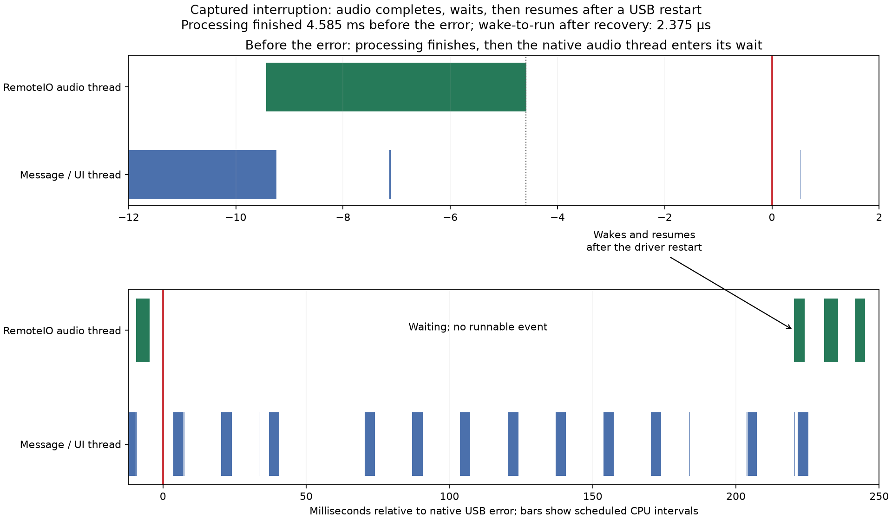
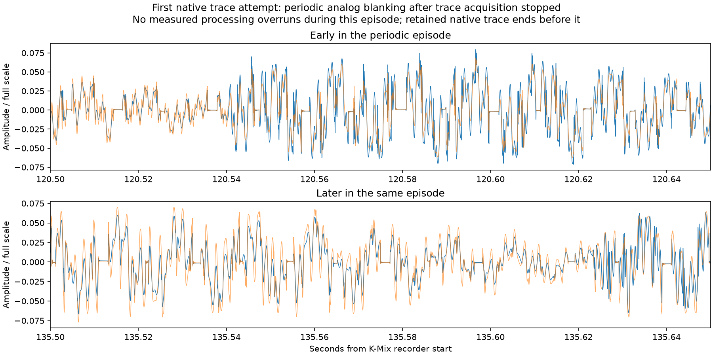

# September 10: native scheduler and USB timing comparison

Completed September 10, 2026. The authorized thermal comparison analysis and focused native tracing are complete. Both audio symptoms remain unresolved. Playback is stopped and all induced device conditions were verified clear at 19:40:03 PDT. No app source, installed binary, saved patch, topology, radio or baseline audio settings changed.

## Main finding: a captured dropout was not an audio-thread scheduling overrun

At **19:36:38.480863**, the unified log reports a MAYA device 4, endpoint 0x82 transaction error, status `0xe00002ed`. The kernel USB trace independently contains the same status, device/endpoint encoding `0x48200`, and emitting thread **1362566**, named **AppleUSB20HubPort@00140000**. This provides a native timing anchor for the same fault.

The last app callback before the error took **4.847 ms** against its **10.667 ms** budget. It finished **4.585 ms before the USB error**. The native RemoteIO thread then entered its wait, with scheduler dispatch state `TH_WAIT=1`, approximately **4.580 ms before the error**. There was no new runnable event for that thread until **220.187 ms after the error**. It was scheduled **2.375 microseconds after that wakeup**. App callback entry-to-entry gap: **229.625 ms**.

The audio thread was waiting for the next audio-service wakeup through the recovery interval. This contradicts a simple explanation in which that callback was runnable but prevented from executing by UI or MIDI work. It does not exclude an earlier workload effect on USB queues, clocking, driver state or the electrical path, and it does not explain every prior glitch.

The message/UI thread continued running, accumulating **40.27 ms scheduled CPU time while audio waited**. The MIDI worker also continued. This supports the user's earlier distinction between a stalled visualizer data stream and a blocked UI thread: the audio callback stopped providing updates, while the message thread remained active.

The kernel USB hub-port thread had wake-to-run delays no greater than **12.63 microseconds** in the 100 ms before through 2 ms after this error; the xHCI controller thread's maximum was **12.80 microseconds**. The app audio thread's maximum wake-to-run delay anywhere in this native window was about **3.21 microseconds**. These measurements do not support millisecond scheduling starvation of these observed threads as the immediate trigger. They do not expose every USB submission deadline, interrupt execution interval or device-internal behavior.

The unified log requests an I/O restart about **36.3 ms** after the transaction error. `performStartIO` records `lockDelayMS 150`. Those events belong to recovery; they should not be treated as the unexplained delay that caused the original USB failure.

## What changed under induced Serious

Two short native windows were captured in each condition within one continuous playback session. Complete app logs verify **48 kHz, 512 frames, normal DSP, visible UI, MIDI sending enabled**, and continuous nominal or Serious state respectively. Initial app-start callbacks are excluded. No sequence holes or logger misses occurred.

| Native window | Retained seconds | State | Long callback stalls | Measured processing overruns |
| --- | ---: | --- | ---: | ---: |
| Nominal 1 | 9.718 | Nominal | 0 | 0 |
| Nominal 2 | 9.711 | Nominal | 1 | 0 |
| Serious 1 | 9.711 | Serious | 0 | 0 |
| Serious 2 | 9.723 | Serious | 0 | 0 |

All four traces have **zero reported lost-event markers and zero context-switch chain mismatches**. The roughly 0.3-second startup exclusion reflects profiler initialization; exposure comes from actual retained event timestamps. These short windows are for mechanism inspection, not a dependable failure-rate comparison. Several additional faults occurred outside them.

Measured app-thread activity barely changed:

| Thread metric | Nominal windows | Serious windows |
| --- | --- | --- |
| MIDI sender wakeups/second | 9,706–9,707 | 9,698–9,699 |
| I/O task worker wakeups/second | 7,863–7,870 | 7,880–7,895 |
| UI scheduled time, fraction of one core | 20.45–20.55% | 20.41–20.69% |
| Audio scheduled time, fraction of one core | 39.44–40.45% | 40.66–40.77% |
| MIDI/audio snapshot priorities | 97 / 97 | 97 / 97 |
| I/O task/UI snapshot priorities | 31 / 47 | 31 / 47 |

The lower nominal audio fraction includes the captured dropout. Scheduled time includes any interrupt time while that thread owns the CPU; it is not a hardware instruction counter. CPU frequency, power draw and every OS policy were not captured. These results do not support the proposed mechanism that Serious simply suppresses our UI or polling workers. They do not prove that no other thermal-policy consequence exists.

The anonymous polling worker was positively identified as `IoTaskThread::Run()` by symbolizing its stack against the matching installed app UUID **276B3E11-789E-39C6-9503-9DEF77868F0A**. The other stack resolves to `MidiSender::run()`. Both use 100-microsecond sleeps in current source. The previous MIDI-off failures still exclude MIDI sending as a necessary condition for all faults.

## Whole recording and the periodic symptom

The completed burst experiment recorded **409.088 seconds**. Twelve long analog interruptions match twelve callback stalls and twelve restart episodes, with **13 MAYA transaction-error messages**: one recovery episode contains two messages. A later error after recording/playback cleanup is excluded. No dense periodic episode was detected in this recording; sparse short candidates are retained. No steady-state measured processing overrun occurred; the one processing overrun was the initial 470-frame startup callback.

The preceding longer trace attempt also produced useful audio evidence despite failing its transfer gate. Its **212.395-second** recording contains five matched USB/restart/callback/analog interruptions, plus a **20.416-second periodic-blanking episode** with 1,210 detected short flat regions (median width **1.281 ms**). There are **no measured processing overruns during that periodic episode**, with continuous callback sequences and no missed-log reports. The native trace retained from that attempt ends before the periodic episode, so it cannot locate the periodic fault inside the native pipeline.

Reported `ioDriftNS` rises from about 4.25 ms to 6.27 ms and then 8.29 ms near that episode's onset. Periodic blanking continues until the first USB-restart interruption; the reported drift resets afterward. This is an association consistent with a timing-state contribution. The values are private, event-driven diagnostics, not a verified physical clock derivative. Kernel acquisition had already been stopped when the episode began, while transfer draining continued; profiling and transport remain potential perturbations.

This preserves an important distinction: some recorded periodic holes accompany alternate processing overruns, but **periodic blanking also occurs while the measured DSP remains comfortably within budget**. Neither observation alone establishes what samples JUCE returned to RemoteIO.

## Capture method, failed attempt and validation

The full Instruments Audio System Trace template is installed, but native `xctrace` cannot discover this Wi-Fi iPad. We used the working authenticated developer connection's kernel scheduler/workgroup/USB-class trace and initial process/thread stackshot. This is not the full Instruments track set; no native output-sample capture or CPU-frequency track was obtained.

One paired connection belongs to each runner. K-Mix inputs 3/4 are recorded continuously on the Mac; no app-file or battery queries occur during individual kernel acquisitions. Profiling/transfer overhead is substantial and is a new observation condition compared with the earlier audio-only experiments.

An all-event capability capture could not keep up. Narrowing event classes and draining after stopping validated a 20-second app-stopped preflight. Under full app workload, the first requested 90-second acquisition still exceeded the transfer/drain budget: only **34.793 seconds** were retained before a bounded abort. Those retained events have no reported loss or switch-chain mismatch, but the requested comparison was incomplete. The runner stopped playback and never induced Serious in that attempt. It is preserved as a failed acquisition, not treated as a 90-second clean trial.

The completed retry used **two 10-second acquisitions per state**, with full draining after each and 120 seconds of ordinary playback before the first. The same filtering and capture settings apply in both states. Normal playback continues through setup/draining and the thermal transition. The user-approved 48 kHz / 512-frame baseline remained fixed.

The v2 raw-trace header requires page alignment after the thread map; its padding contains nonzero bytes. Our decoder aligns to 4096 bytes and preserves CPU IDs rather than interpreting padding as events. Initial stackshots provide paired mach/wall timestamps; cached connection wall time is ignored. The native error and unified-log timestamp agree within about **0.44 ms**. Fine-grained before/after measurements use one mach clock shared by the native trace and app callback instrumentation.

Scheduler argument interpretation was checked against [Apple's scheduler source](https://github.com/apple-oss-distributions/xnu/blob/main/osfmk/kern/sched_prim.c) and [trace definitions](https://github.com/apple-oss-distributions/xnu/blob/main/bsd/sys/kdebug.h), with local source snapshots retained. `MACH_SCHED`/stack handoff identify outgoing and incoming threads; `MACH_MAKE_RUNNABLE` identifies the target thread; dispatch state records whether the outgoing thread is waiting. Runtime kernel: Darwin 25.6.0, `xnu-12377.162.14~4`, ARM64 T8122. Public source is interpretive provenance, not a claim to possess Apple's matching private USB-driver source.

## Decision and next useful cut

The original thermal comparison still stands as **22 versus 6 matched failures**, with third-run **8 versus 5** weakening the early apparent effect and no successful same-session nominal reversal. The new traces do not turn that association into a thermal fix.

For the captured sporadic event, pursue the USB/driver/presentation path before changing UI or MIDI priority on the assumption that they delayed the audio callback. For periodic corruption, the next useful measurement is the complete native RemoteIO boundary: entry/exit timing, host/sample timestamp validity and continuity, render/lock status, app invocation identity, and a bounded history or zero-run measurement of the actual outgoing samples. Intact outgoing samples with analog holes implicate a later stage; already-damaged native output directs inspection to the exact app/JUCE branch. This is queued, **not implemented or deployed by this tracing step**. Retain the same normal workload and permanent rate/buffer baseline.

## Evidence

- [Complete analysis and matches](summaries/native-trace-final-20260910.json).
- [Nominal 1 scheduling](summaries/native-trace-nominal1-20260910.json), [Nominal 2 scheduling](summaries/native-trace-nominal2-20260910.json), [Serious 1 scheduling](summaries/native-trace-serious1-20260910.json), [Serious 2 scheduling](summaries/native-trace-serious2-20260910.json).
- Raw completed experiment: `/private/tmp/smartgrid-system-trace-r2-20260910`.
- Raw failed long acquisition: `/private/tmp/smartgrid-system-trace-r1-20260910`.
- [Artifact hashes and source snapshots](summaries/native-trace-artifacts-20260910.json).
