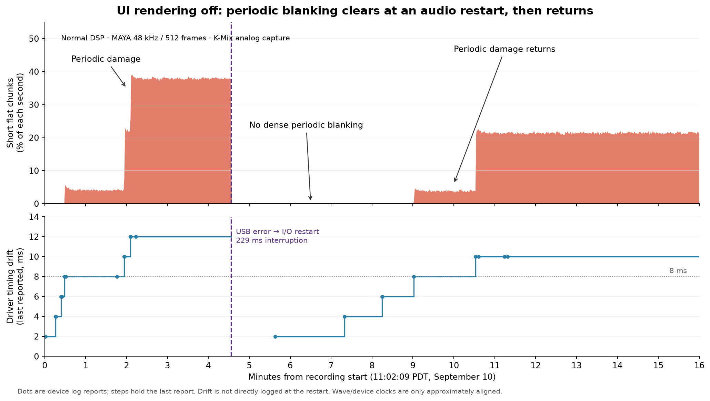
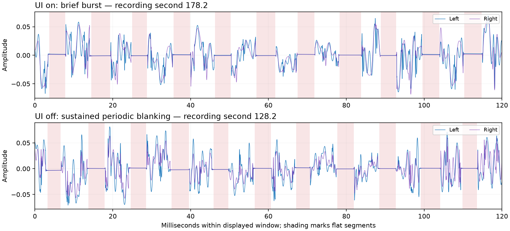

# SmartGridOne iPad: completed UI comparison, September 10, 2026

Disabling recurring UI rendering did **not eliminate either audio failure**. Normal processing with the UI off produced one USB-restart dropout and about eleven minutes of periodic sub-buffer blanking during a sixteen-minute recording. The most useful new evidence is that the long dropout cleared the periodic damage, which returned when reported driver timing drift accumulated again.

Automatic playback now works for experimental launches. The optional `SMARTGRID_AUDIO_TEST_PLAY=1` flag sets the existing engine's `m_running=true` after configuration loads and before the audio device opens. Both compared runs used the same reviewed, signed build and the same saved patch/configuration.

## Measured results

All times are PDT, September 10. Recordings are analog stereo from K-Mix inputs 3/4, 48 kHz, 24 bit.

| Condition | Measured recording | Long audio interruptions | USB restart episodes | Periodic blanking |
|---|---|---:|---:|---|
| Previous pure-tone build, Wi-Fi on | 10:01:43–10:17:43; 960 s | 0 | 0 | None detected ≥0.4 ms in this run |
| Normal DSP, UI on, automatic Play | 10:52:52.972–10:59:15.521; 382.549 s | 17, each 222.75–229.79 ms | 17 | One dense burst, WAV 177.617–180.362 s |
| Normal DSP, UI off, automatic Play | 11:02:09.031–11:18:09.031; 960 s | 1, 229.46 ms | 1 | WAV 29.061–273.160 s and 541.650 s through the end |

UI-on was stopped early after repeated reproduction, so these are unequal exposures. This is one sequential pair with bursty failures, not a causal estimate of how much UI rendering changes the dropout rate. Three additional transaction failures occurred during UI-off startup, before its measured recording. The earlier pure-tone build differs in workload and binary; its single clean exposure is context, not proof that tone mode is safe. Prior pure-tone recordings already reproduced periodic damage.

The user's observation of many sporadic dropouts around 11:00 agrees with further kernel transaction errors at 10:59:48.021, 10:59:59.437 and 11:00:10.185. Those events happened after the measured UI-on WAV ended, during the interval that included log collection. They are preserved as a separate observation and excluded from the table's event count.

## Sporadic interruption: a confirmed driver restart

All 17 measured UI-on interruptions matched an app callback gap and driver restart. There were 18 kernel transaction-error messages because two messages belonged to one interruption. Counting kernel and usbaudiod descriptions separately would also double-count the same failure.

The UI-off interruption has a particularly clear chain:

- **11:06:42.326462:** kernel reports MAYA44 USB+ endpoint **0x82**, status `0xe00002ed (transaction error)`.
- **11:06:42.326650:** usbaudiod requests a configuration change from `AUAInputTransferManager_completeBlock`.
- The audio service stops I/O, aborts both input and output requests, and destroys their transfer managers.
- **11:06:42.362158:** the service restarts I/O. Input and output clock programming still requests **48000 Hz**. New transfer managers and USB timestamp correlation start; the log reports **150 ms lock delay**.
- The app's next callback has a **228.126 ms arrival gap**. Its instrumented DSP work takes **4.641 ms**.
- The analog recording contains a corresponding **229.46 ms interruption**. The preceding periodic blanking ends at that interruption and does not resume immediately.

This establishes why these particular long gaps occur: the audio stack restarts after an input-endpoint transaction failure. It does not establish why the transaction fails. Requesting zero app inputs has not stopped the iPad USB driver from running the MAYA input endpoint or coupling its failure to output playback.

WAV and device times have approximately 0.13 s offset here from recorder startup/latency and independent clocks. Event matching uses a conservative 0.75 s neighborhood and verifies unique waveform/callback episodes. These offsets must not be interpreted as transport latency or sample-accurate cause/effect delays.

## Periodic damage: repeatable drift accumulation and recovery

During UI-off, 17 driver messages report **22 zero-length input transfers**. Before the restart, the cumulative zero-length count reaches 12 and `ioDriftNS` reaches about 12 ms. After the restart, a new input transfer manager's count starts over and later reaches 10, with drift around 10 ms. The logs do not print an explicit zero-drift value at the restart; resetting the accumulating state is an inference supported by the new manager, reset count, lower subsequent drift and waveform recovery.

The same progression appears twice within the measured UI-off recording:

| Driver state in this run | Representative recorded behavior |
|---|---|
| About 2, 4 or 6 ms drift | No dense short-hole pattern detected |
| About 8 ms drift | Dense periodic blanking begins; typical detected holes about 0.9–1.0 ms wide, spaced about 21.333 ms apart |
| About 10 ms drift | Typical holes about 2.3 ms wide, spaced about 10.667 ms apart, roughly 94 holes/s |
| About 12 ms drift, reached before restart | Typical holes about 4.1 ms wide, roughly 38% of each second flat |
| After the long USB-restart interruption | Dense periodic blanking clears for about 268 s, then returns near the next 8 ms drift report |

The first dense onset is at WAV 29.061 s, near the driver reaching 7.999959 ms at nominal recording time 28.904 s. The second is at WAV 541.650 s, near the driver reaching 8 ms at 541.503 s. Within the available cross-device timing accuracy, both start near that same reported value. Two paired zero-length transfers repeatedly accompany about 2 ms drift increments. Small numerical variations also appear between those increments.

This supports the user's hypothesis that **a growing portion of each buffer is damaged**, and also shows a cadence change: detected spacing moves from two 512-frame periods to one. At 48 kHz, 512 frames is 10.667 ms; 8 ms is 384 samples. The measured holes can be shorter than the full damage because analog settling and the detector threshold hide their edges. The observed 8 ms association belongs to this trace; it is not an established universal threshold or a proved ring-buffer formula.

The UI-on recording also has 233 short holes in a 2.745 s dense burst after an earlier restart. Its driver drift then rises rapidly without any zero-length-transfer reports in the measured window, and the waveform recovers while reported drift continues increasing. Therefore neither logged zero-length transfers nor a simple monotonic relation between drift and audible damage explains every observed episode. The lower-level timestamp/buffering path remains the strongest lead, but the complete mechanism is unresolved.

## What this says about the two symptoms

**Observed:** frequent sporadic restarts in UI-on; much fewer during the measured UI-off run; periodic damage in both; an actual restart clearing sustained periodic damage in UI-off.

**Working inference:** frequent restarts can clear or conceal accumulating periodic corruption. That gives a concrete explanation for why a low-workload pure-tone run could show severe periodic damage but few sporadic dropouts, while heavier normal runs show many dropouts and less sustained periodic damage. Lower workload may also alter the underlying failure probability. This comparison does not prove that explanation for every earlier test or establish that both symptoms share one root cause.

Recurring drawing and display updates are not required for either symptom. The experiment did **not** disable the entire message thread: it retained its timer, state interchange, log draining and platform polling, and kept normal DSP, MIDI and state production. It does not rule out those remaining paths or shared scheduling effects. It also does not prove that removing UI rendering caused the lower measured restart count.

## Configuration and timing checks

Both compared runs used MAYA44 USB+, actual **48000 Hz / 512 frames**, zero application inputs and four outputs throughout the recorded callbacks. The saved `ms` patch, stereo setting and internal clock were unchanged; MAYA and WB stayed connected through the same hub. Wi-Fi remained on and Bluetooth off. No device service reads, screenshots, installs or archive collection ran during either measured recording.

| Instrumented callback measurement | UI on | UI off |
|---|---:|---:|
| DSP median | 4.296 ms | 4.214 ms |
| DSP p99 | 4.977 ms | 4.927 ms |
| DSP maximum | 5.146 ms | 5.010 ms |
| Instrumented DSP regions exceeding 10.667 ms | 0 | 0 |
| Callback gaps >20 ms | 17 | 1 |
| JUCE sample-timestamp discontinuity counter change | +17 | +1 |
| iPad thermal state / low-power flag | Nominal / off | Nominal / off |
| Missing callback sequence entries / logger-miss reports | 0 / 0 | 0 / 0 |

`dsp_us` measures the instrumented processing region. It excludes subsequent callback logging and surrounding JUCE/native audio work, so this is not a blanket statement that every real-time operation met its deadline. JUCE iOS `getXRunCount()` increments when successive native callback sample timestamps are discontinuous; it is not a direct DSP execution-time overrun counter. Periodic damage continued without callback gaps or counter increments. The thermal observation is the iPad's, not the interface's.

Two excluded autoplay launch attempts reported 606 setup frames despite 512-frame callbacks, then actual 44.1 kHz rejected by the application's guard. The third UI-on launch and the UI-off launch verified 48k/512 before recording. Those startup anomalies remain a separate audio-session negotiation lead; no sample-rate switch occurred in these measured runs.

## Implementation, current device state and reproducibility

The autoplay extension and UI controls passed independent task and integrated reviews, a signed iOS Release build, strict signature verification and hardware startup checks. They remain an uncommitted disposable prototype in [the existing worktree](historical-context/docs/superpowers/plans/2026-09-10-audio-ui-isolation.md). No JUCE upgrade or backend rewrite was included.

- Signed app binary SHA-256: `50cd149fb3456c70ee5e4c380b2878718d1dc8a99df7514520e44339ab190906`.
- Installed package: `/private/tmp/smartgrid-ui-isolation-autoplay-20260910.ipa`; upgraded in place at 10:48:55.
- Config SHA-256: `1a57b9b6404191b86e85b7f1c50b8e5ebbef7d8cad072a6e5234b367c805b9ec`.
- Saved patch SHA-256: `a0e797a87de665e300dcf8ff484774ee93639c8c7d425a67ddc0aabb2223952a`.
- Config and patch hashes still matched after the UI-off run.
- Both recordings and historical log collections are complete. Normal visible UI was restored at 11:27:21 with normal processing, automatic Play and verified MAYA 48k/512; PID 17791.
- The temporary general Wi-Fi connection preference was restored and verified false at 11:29:06; the confirmation is in `/private/tmp/smartgrid-wifi-setting-restored-20260910.json`. Wi-Fi radio and wireless debugging are left unchanged.

Authenticated Wi-Fi app upgrade, launch with environment variables, app log retrieval, device screenshots and historical system-log collection are now verified. A maintained Apple heartbeat was necessary for direct paired service access. Native Xcode multicast discovery remains unavailable, but these completed operations used authenticated direct connections.

Primary evidence bases:

- [UI-on correlation](/private/tmp/smartgrid-ipad-autoplay-ui-on-r3-20260910.correlation.json), [callback summary](/private/tmp/smartgrid-ipad-autoplay-ui-on-r3-20260910.callbacks.json), [refined dropouts](/private/tmp/smartgrid-ipad-autoplay-ui-on-r3-20260910.refined-dropouts.json), [WAV](/private/tmp/smartgrid-ipad-autoplay-ui-on-r3-20260910.wav).
- [UI-off correlation](/private/tmp/smartgrid-ipad-autoplay-ui-off-20260910.correlation.json), [callback summary](/private/tmp/smartgrid-ipad-autoplay-ui-off-20260910.callbacks.json), [refined dropout](/private/tmp/smartgrid-ipad-autoplay-ui-off-20260910.refined-dropouts.json), [WAV](/private/tmp/smartgrid-ipad-autoplay-ui-off-20260910.wav).
- [Periodic episode statistics](/private/tmp/smartgrid-ui-periodic-summary-20260910.json). Full raw app logs, system JSON and logarchives are saved beside each base.
- Analysis scripts: `smartgrid_audio_activity.py`, `smartgrid_scan_flat_candidates.py`, `smartgrid_refine_dropouts.py`, `smartgrid_analyze_callback_log.py`, `smartgrid_correlate_trial.py` and `smartgrid_summarize_ui_periodic.py`, all under `/private/tmp`.

Near-silence detection alone misses this periodic symptom. The periodic scan identifies short flat regions in both channels and groups dense recurring clusters; isolated candidates may be natural quiet or smooth music. Raw waveform inspection and the 512-frame cadence corroborate the dense clusters. An earlier mostly stopped-transport preflight is marked invalid for sustained-audio comparison and retained only as a workload/system trace.

The next experiment should target audio-session/backend configuration or the USB timing path while preserving the normal workload and scoring both symptoms. This evidence gives little reason to expect simply suppressing more drawing to cure either failure. A JUCE version/configuration comparison should retain actual route/rate/frame verification and both waveform detectors; a clean short run or fewer long gaps would be insufficient to call it fixed.
